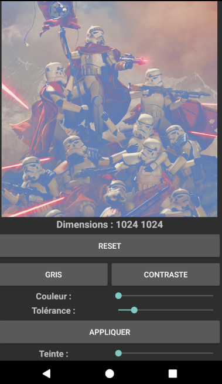
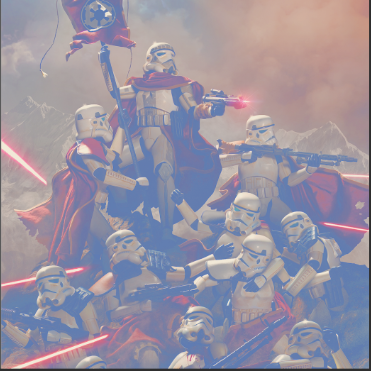
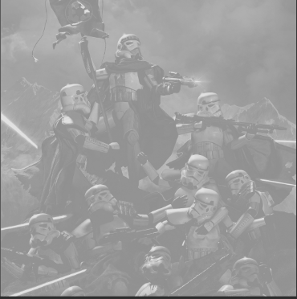
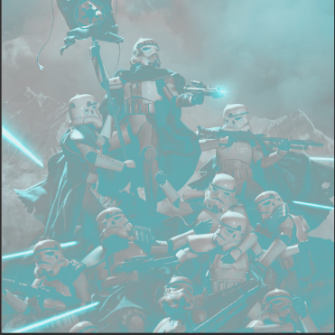
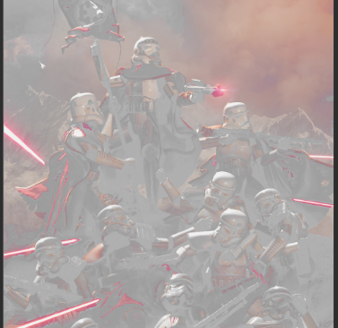
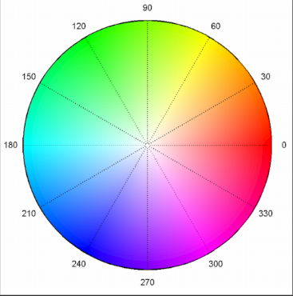
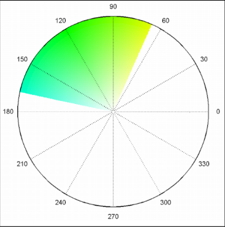
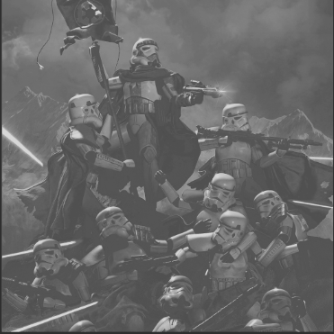
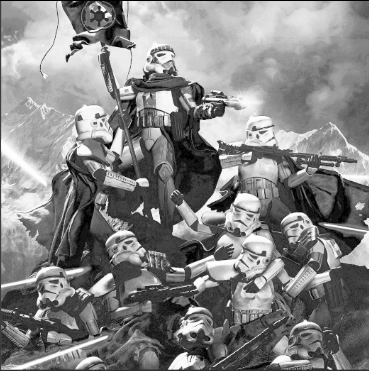

# Application Android de retouche d'images
Application réalisée dans le cadre de l'UE "projet technologique", L3 Informatique de l'Université de Bordeaux.
La version actuelle correspond aux TD 1, 2 et 3.
**NB:** Chaque méthode/classe du projet est documenté par un entête Javadoc

## Lancer l'application:
Le projet prend la forme d'un projet Android Studio, il est donc parfaitement exécutable depuis le logiciel.

Version SDK mimimum : 21 (Lollipop)

### Changer d'image :
Pour changer l'image modifiable, il suffit de modifier la variable de classe `PICTURE` de la classe `MainActivity` et de relancer l'application. Les images disponibles sont incluses dans les resources de l'application, dans le dossier `\app\src\main\res\drawable`

## Structure du projet:
Le projet est divisé en 4 classes :
* `MainActivity`
La classe principale, activité Android où est gérée l'interface et la gestion des évènements de ses éléments. A la création de l'activité l'image sélectionnée est chargée sous la forme d'une instance de `Picture`.
L'image chargée est limitée à 1080 pixels de hauteur, elle est chargée en plus petite dimension si besoin.
La classe charge aussi une version de l'image plus petite, utilisée pour les aperçus.

* `Utils`
Classe contenant des méthodes statiques utiles, comme des conversions HSV<->RGB, ...

* `Picture`
Représente une image éditable.

* `Effects`
Contient des méthodes statiques, une série d'effet applicables sur des instance de `Bitmap` ou de `Picture`

## Classe Picture:
Cette classe encapsule principalement une instance de `Bitmap` mais en simplifie la manipulation.

Le constructeur principal permet de charger l'image, une surcharge permet de spécifier une taille désirée de l'image. Un autre constructeur permet de charger une image par copie (utilisation déconseillée, voir la section "Remarques").

Il est possible de `reload()` l'image, ce qui rechargera l'image depuis le fichier source.

La méthode `reset()` permet de restaurer l'image comme elle était à son chargement initial ou à la dernière sauvegarde avec `quickSave()`.

Est associé également à l'objet une liste d'histogrammes , des méthodes permettent de générer des histogrammes différents (pour l'instant l'histogramme des niveaux de gris et des niveaux de luminance).

## Effets disponibles:
Durée d'exécution sur l'émulateur suivant : NEXUS 5X, API 25, 1080*1920 px, 420dpi. Au moment du test l'image avait une dimension dans les tableaux de 1024 * 1024;

### `grayLevel()` :
Donne une image en noir et blanc (instantané):

`grayLevelOld()` qui utilise getPixel() est beaucoup plus long (12 secondes).

### `colorize()` :
Applique la teinte sélectionnée à l'image, en passant par l'espace HSV (2 secondes):

### `keepColor()` :
Garde les teintes dans l'intervalle sélectionné, le reste de l'image est grisé en supprimant la saturation (2 secondes):

Autre exemple sur le vert:

### `linearDynamicExtension()` :
Étend la plage de valeur d'un histogramme en particulier (23 secondes, 0 si l'histogramme est déjà généré).
Permet par exemple d'améliorer le contraste sur l'histogramme des niveaux de gris:

### `histogramFlattening()` :
Égalise l'histogramme passé en paramètre (22 secondes, 0 si l'histogramme est déjà généré)
Permet par exemple d'améliorer le contraste sur l'histogramme des niveaux de gris:

Ne donne pas de bon résultat sur l'histogramme de luminance, à debugger ou expliquer.

## Remarques et avis sur le code et les librairies:
* Si l'application rame, utilisez l'image la plus petite (poivrons), voir raisons ci dessous.

### Bitmap 
* `Bitmap` n'est pas une librairie facile d'utilisation.
* Le chargement des images en 2 étapes est un peu étrange, de même il existe de nombreuses manières de charger un fichier dans un Bitmap.
* Les dimensions de l'image sont très instables, il existe plusieurs méthodes pour récupérer les valeurs de largeur et de hauteur. Aucune ne précise son unité dans la documentation. Dans de très rare cas seulement cette unité est en pixels. Sinon généralement en dp, variant énormément d'un appareil à l'autre (du simple au triple).
* De même la méthode `getPixels()` ne travaille qu'avec un tableau, un même fichier chargé avec 2 méthodes différentes des classes `Bitmap` et `BitmapFactory` ne donnera pas la même image à quelques dp près, ce qui entraîne de nombreuses exception lors de l'appel à `getPixels()`.
* L'option `inSampleSize` n'est pas non plus stable, à cause de la mauvaise gestion des unités de la librairie, sur certains appareils la limite de taille saute complètement.
* L'exécution sur mon appareil personnel est impossible, les méthodes de `Bitmap` comme celles de `BitmapFactory.Options` pour récupérer les dimensions semblent toujours travailler avec des dp, ce qui donne une image beaucoup trop grande malgré la limite de taille.
* On notera également que au chargement d'une image petite (2x2 pixels par exemple) celle ci est chargée en taille 5x5, même en désactivant tout système de ratio.

### Améliorations possibles du code:
* Il pourrait être intéressant de sauvegarder autrement l'image, le tableau original est un tableau beaucoup trop grand. (List ?).
* Il pourrait être intéressant de sauvegarder un historique des effets appliqués à un objet `Picture`, ou un historique des images, pour pouvoir éventuellement annuler des opérations.
* Les histogrammes ne sont pas affectés par les effets appliqués, il faudrait donc les re-générer avant d'appliquer un nouvel effet utilisant les histogrammes.

